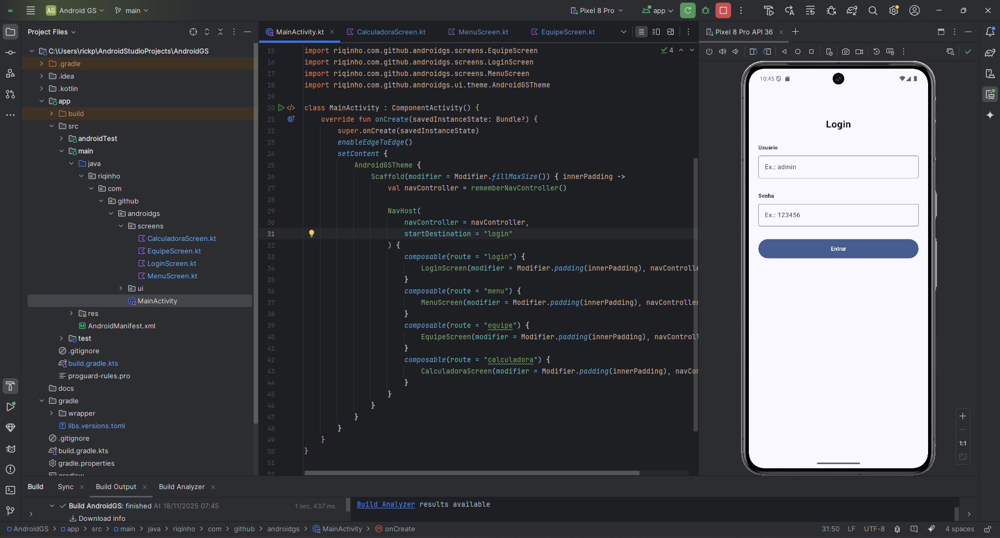
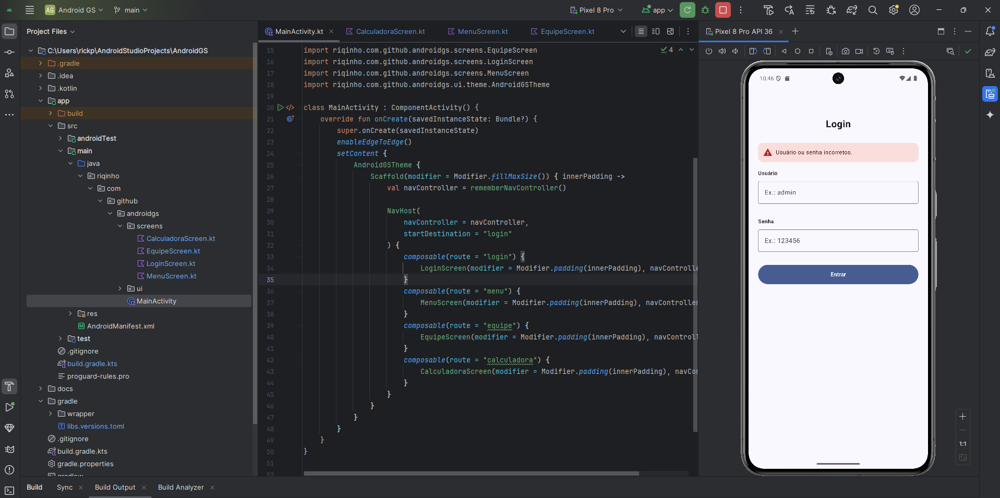
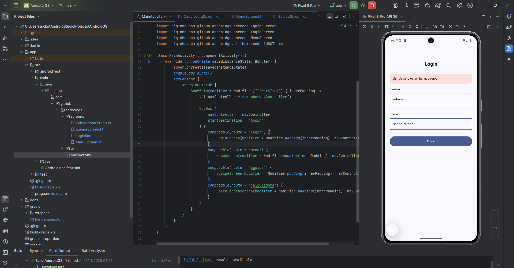
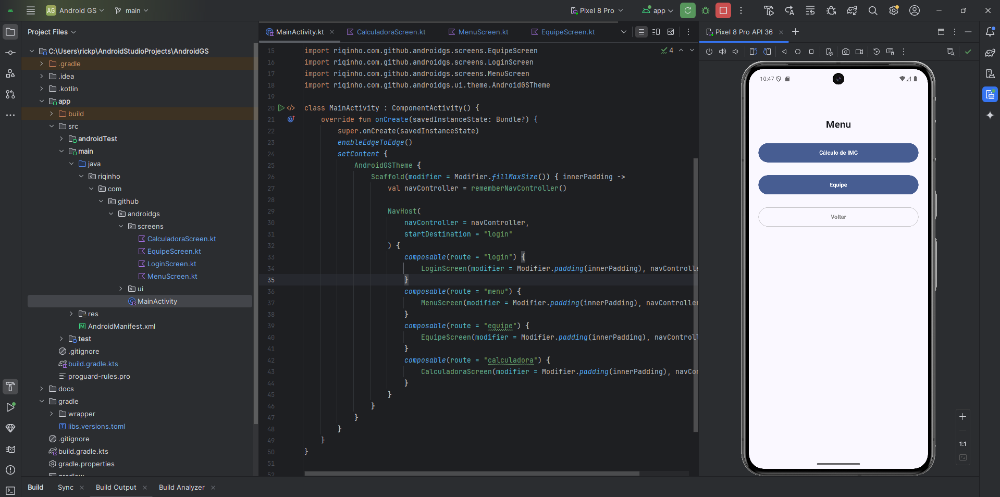
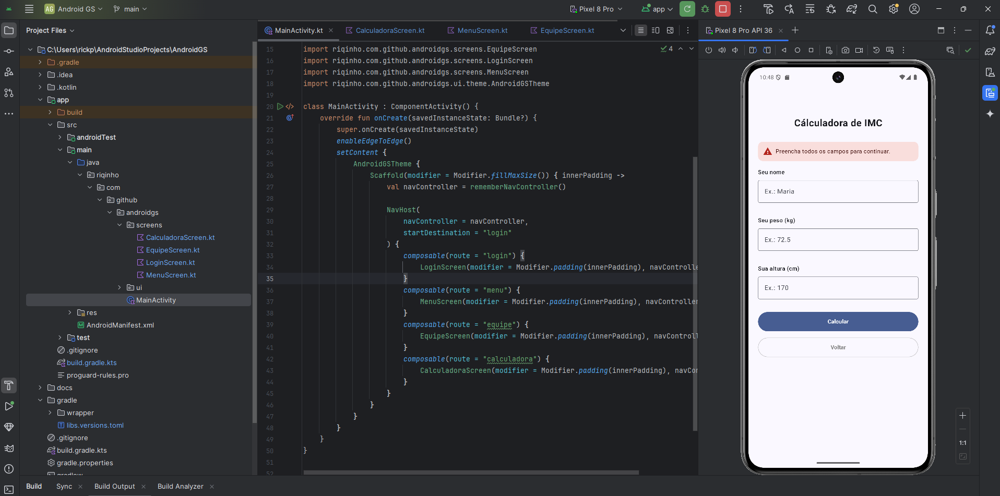
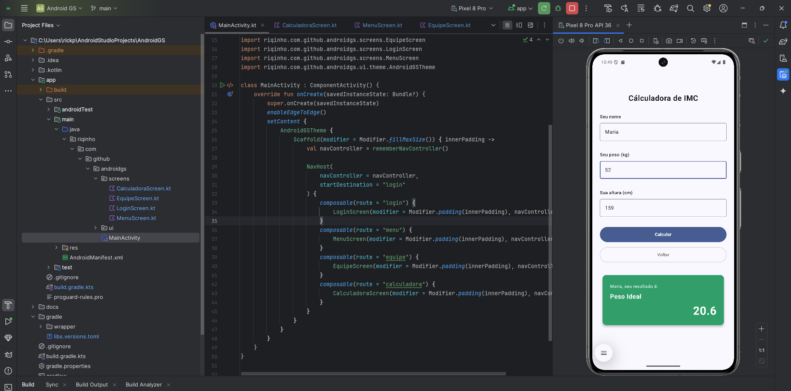
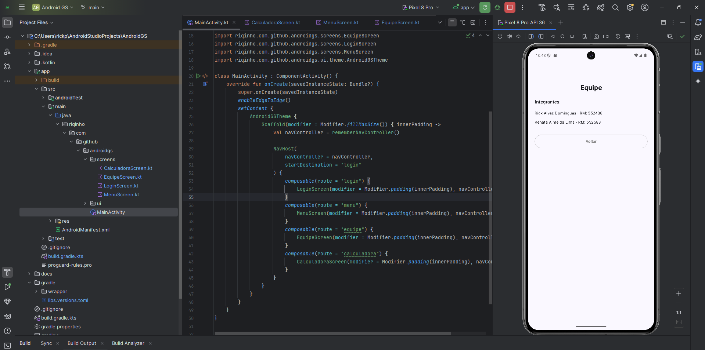

# 📱 Aplicativo de Cálculo de IMC – Android Compose

Projeto simples desenvolvido em **Jetpack Compose**, contendo:

- Tela de **Login**
- Tela de **Menu**
- Tela de **Cálculo de IMC**
- Tela de **Resultado**
- Tela **Equipe**

O objetivo é demonstrar navegação, estados, validações e UI básica utilizando Compose.

---

## 👥 Integrantes

- **Rick Alves Domingues** – RM: 552438
- **Renata Almeida Lima** – RM: 552588

---

## 🖼️ Prints de Funcionamento

As capturas de tela estão na pasta `docs/` na raiz do projeto.

### **Login**
| Tela | Campos Vazios | Credenciais Inválidas |
|------|---------------|------------------------|
|  |  |  |

---

### **Menu**

---

### **Cálculo de IMC**
| Campos Vazios | Resultado |
|---------------|-----------|
|  |  |

---

### **Equipe**

---

## 🧱 Tecnologias Utilizadas

- **Kotlin**
- **Jetpack Compose**
- **Navigation Compose**
- **Material 3**

---

## 📌 Observação

O projeto foi desenvolvido com foco didático, mantendo a interface simples, funcional e clara, demonstrando manipulação de estado e navegação entre telas.
